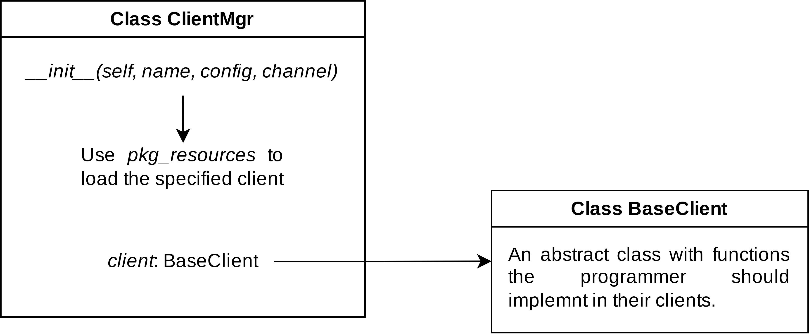

Add a new client
====================================

At now, efb-qq-slave decouples the client part where the user can specify the client with configurations. This part will talk about the functionality of efb-qq-slave to allow the programmer to create a new client quickly.

The architecture of efb-qq-slave
-------------------------------------

Below is the architecture of the efb-qq-slave:

From the above picture, we can know that efb-qq-slave encapsulates the ``client`` in the ``ClientMgr`` class. And uses the ``pkg_resources`` module to dynamically load the specified client.

.. code:: python

    def __init__(self, name: str, config: Dict, channel):
        try:
            for entry_point in pkg_resources.iter_entry_points('ehforwarderbot.qq.plugin'):
                if entry_point.name == name:
                    c = entry_point.load()
                    cls = getattr(c, name)
                    self.client = cls(name, config, channel)
                    return
        except:
            raise Exception("Specified client not found!")
        raise Exception("Specified client not found!")

- Define ``entry_point``:

  1. If you use ``setup.py``, add the following into the ``setup.py``:

     .. code:: python

        setup(
            entry_points={
                'ehforwarderbot.qq.plugin': '<name> = efb_qq_plugin_<name>:<name>'
            }
        )

  2. If you use ``pyproject.toml``, add the following into the ``pyproject.toml``:

     .. code:: toml

        [project.entry-points."ehforwarderbot.qq.plugin"]
        <name> = "efb_qq_plugin_<name>:<name>"

BaseClient
-------------------------------------

As a developer, you need to define a class whose name is consistent with that defined in ``setup.py`` or ``pyproject.toml``, and inherit the ``BaseClient`` class to implement the abstract methods defined by it.

Some reference
-------------------------------------

You should look at the docs about the `ehforwarderbot docs <https://ehforwarderbot.readthedocs.io/en/latest>`_ for more information to create a new client.
