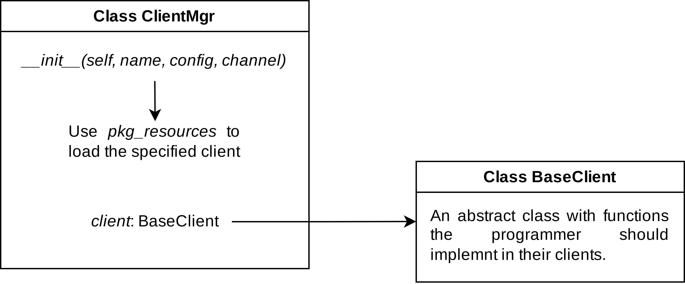

添加一个新的客户端。
====================================

目前，efb-qq-slave 解耦了客户端，用户通过编写配置文件指定特定的客户端。本部分内容拟通过讲解 efb-qq-slave 的实现方式，为开发者开发一个新的客户端提供快速入门。

软件架构
-------------------------------------

efb-qq-slave 的整体架构图如下图所示：

从上图可以看出，efb-qq-slave 通过 ``ClientMgr`` 封装了 ``client``，其通过 ``pkg_resources`` 动态加载与配置文件对应的客户端。

.. code:: python

    def __init__(self, name: str, config: Dict, channel):
        try:
            for entry_point in pkg_resources.iter_entry_points('ehforwarderbot.qq.plugin'):
                if entry_point.name == name:
                    c = entry_point.load()
                    cls = getattr(c, name)
                    self.client = cls(name, config, channel)
                    return
        except:
            raise Exception("Specified client not found!")
        raise Exception("Specified client not found!")

从上述的代码我们可以得出以下的重要信息，作为一个开发者需要实现以下的功能：

- 在客户端项目中定义 ``entry_point``：

  1. 如果你使用 ``setup.py``，在 ``setup.py`` 添加如下的内容：

     .. code:: python

        setup(
            entry_points={
                'ehforwarderbot.qq.plugin': '<name> = efb_qq_plugin_<name>:<name>'
            }
        )

   2. 如果你使用 ``pyproject.toml``，在 ``pyproject.toml`` 添加如下的内容：

     .. code:: toml

        [project.entry-points."ehforwarderbot.qq.plugin"]
        <name> = "efb_qq_plugin_<name>:<name>"

BaseClient
-------------------------------------

作为开发者，你需要定义一个类其命名与 ``setup.py`` 或者 ``pyproject.toml`` 中定义的命名一致，并继承 ``BaseClient`` 类实现其定义的抽象方法。

其它参考
-------------------------------------

你应该查看 `ehforwarderbot <https://ehforwarderbot.readthedocs.io/en/latest>`_ 的文档，以获取如何开发一个新客户端的更多信息。
